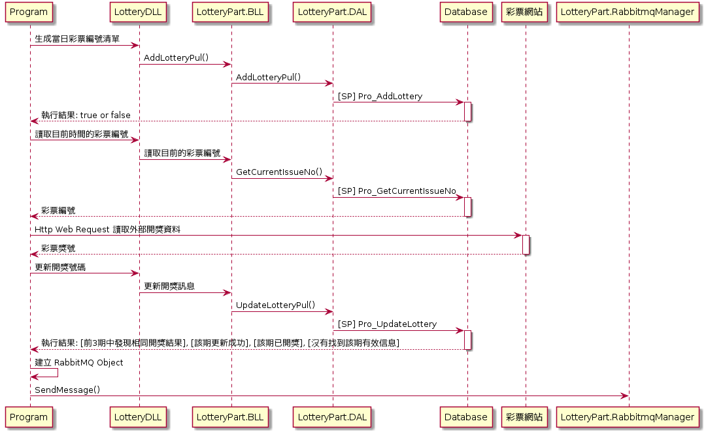

# HecBetLottery Project Documentation

### Introduction

> 開獎採集 LOTTERY
> 
> 從彩票網站擷取數據，並觸發開獎與發佈獎項

### Projects

|名稱|專案名|涵蓋彩種|
|----|------|--------|
|分分彩|FFC|和盛三分彩、和盛時時彩、和盛十一選五、和盛PK10|
|秒秒彩|GrabData_SEC|和盛秒秒彩、PK10秒秒彩|
|新彩種|NewLottery|新疆時時彩、山東十一選五、北京PK10、江蘇快三、天津時時彩、台灣5分彩、韓國5分彩|
|舊彩種|OldLottery|重慶時時彩、福彩3D、體彩排列三、廣東11選5、北京快樂8|

### Dependencies

|專案名|描述|
|------|----|
|LotteryDLL|Common library for data access layer|
|LotteryPart.AwardBase|開獎邏輯、玩法|
|LotteryPart.BLL|處理 SendMail、Log、Call Data Access Layer|
|LotteryPart.DAL|資料庫通用類別、DES加解密、存取資料庫<br />SQLBase Class 為主要操作 Database 與 StoredProcedure 的主要類別|
|LotteryPart.Model|與底層進行資料交換的 Model，包含獎號擷取結果(ResultStruct)、RabbitMQ 資料交換結構|
|LotteryPart.RabbitmqManager|與 RabbitMQ 進行溝通的 Common Library，主要核心在 RabbitmqBLL|

> LotteryDLL 與 LotteryPart.BLL 部分的行為雷同，但也互相依存，LotteryDLL 比較貼近 Service Layer  
> 
> LotteryPart.RabbitmqManager 獨立在 RefLib\LotteryPart.RabbitmqManagerNet40
> 
> 商用邏輯層 BLL = Business Logic Layer  
> 資料存取層 DAL = Data Access Layer  

### 基本運作流程



# Getting Started

### FFC 分分彩

上述專案皆採取多執行敘方式進行開獎及配獎。
1.	Installation process
2.	Software dependencies
3.	Latest releases
4.	API references

# Build and Test
TODO: Describe and show how to build your code and run the tests. 

# Contribute
TODO: Explain how other users and developers can contribute to make your code better. 

If you want to learn more about creating good readme files then refer the following [guidelines](https://www.visualstudio.com/en-us/docs/git/create-a-readme). You can also seek inspiration from the below readme files:
- [ASP.NET Core](https://github.com/aspnet/Home)
- [Visual Studio Code](https://github.com/Microsoft/vscode)
- [Chakra Core](https://github.com/Microsoft/ChakraCore)

```js
function areEqual(a, b) {
  if (a == b) {
    return false;
  }
}
```

# Documentation Work

|Sprint|Date|Editor|Work|
|-----:|-----|------|----|
|S1|2017.01.05|Eric Chen|Init.|
|||||
|||||
|||||
|||||
|||||
|||||
|||||

